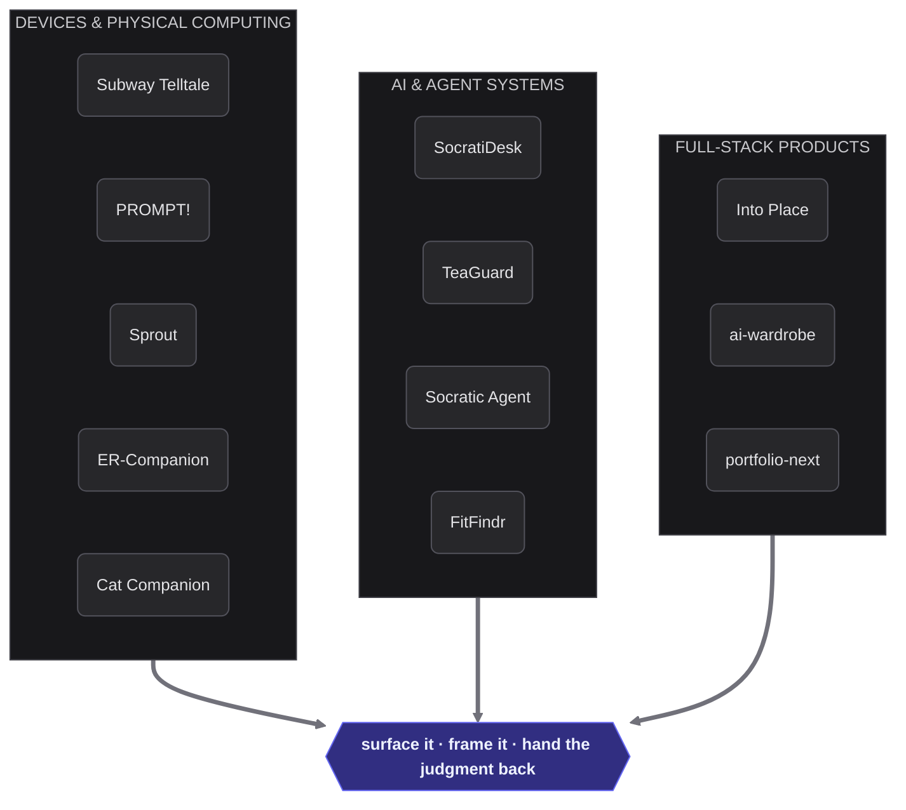

<h1 align="center">Dingran Dai</h1>

  <strong>Creative Technologist & AI Builder</strong> — Designer who builds, engineer who sketches 
  Architechture → Applied Information Science @ Cornell Tech

  
  
  

 
## Design for noticing, not for answers

A street never tells you where to walk. It widens a sightline, drops a threshold, puts a bench where you'd hesitate — and leaves the decision to you. Five years of planning taught me that the strongest intervention is the one that changes what you *notice*.

So that's what I build, in silicon now instead of concrete. Every project below surfaces something that was already there but unattended, frames it so a person can act in one glance, and then gets out of the way. None of them hand down a verdict.

 

### ◾ Devices & Physical Computing
*ESP32 · CircuitPython · Jetson · sensors · 3D printing*

**[Portable Subway Telltale](https://github.com/Daidai1031/Portable-Subway-Telltale)** — Keychain ambient display for Roosevelt Island. One glance tells you whether to run.
**[PROMPT!](https://github.com/Daidai1031/PROMPT-)** — AI literacy card game for kids 10+. They say what they notice out loud; a coach replies. Fully offline on a Jetson, so no child's voice leaves the table.
**[Sprout](https://github.com/Daidai1031/Sprout)** — Chest-clip wearable that turns posture into physics-driven bubbles. Visualizes, never nags.
**[ER-Companion](https://github.com/Daidai1031/ER-Companion)** — Low-cost wristband that catches falls and seizures for ER patients who can't speak for themselves.
**[Cat Companion](https://github.com/Daidai1031/ubicomp-cat-companion)** — A 3D-printed cat you level up by keeping your own daily quests.

### ◾ AI & Agent Systems
*RAG · ReAct agents · on-device inference · multi-signal classification*

**[SocratiDesk](https://github.com/Daidai1031/SocratiDesk)** — Voice-first study companion that asks instead of answers. No tabs, no copy-paste, just thinking aloud.
**[TeaGuard Trust API](https://github.com/Daidai1031/teaguard-trust-api)** — Screens anonymous reviews for privacy and defamation risk. Refuses to rule on truth; flags what needs a human.
**[Socratic Agent](https://github.com/Daidai1031/socratic-agent-local)** — Local ReAct agent scaffold behind the Socratic experiments.
**[FitFindr](https://github.com/Daidai1031/ai201-project2-fitfindr-starter)** — Three-tool agent with a planning loop: finds secondhand listings, styles them against your wardrobe, writes the caption.

### ◾ Full-Stack Products
*Next.js · Supabase · fal.ai · Flask*

**[Into Place](https://github.com/Daidai1031/into-place)** — Drop a pin and a place's real archive becomes a short film you direct. Sourced material keeps its era and license; every generated frame stays labeled as generated.
**[ai-wardrobe](https://github.com/Daidai1031/ai-wardrobe)** — Shoot your closet once, then let it dress you for the weather.
**[portfolio-next](https://github.com/Daidai1031/portfolio-next)** — This site, hand-built. Next.js 16, Tailwind v4, MDX.

 

## Bench

| | |
|:--|:--|
| **Design** | Figma · Rhino · Fusion 360 · Illustrator · AutoCAD · Adobe Creative Suite|
| **Frontend** | TypeScript · Next.js · React · Tailwind · MDX |
| **Backend** | Python · Flask · FastAPI · SQL · SQLAlchemy · Supabase |
| **AI** | LLM orchestration · RAG · ReAct agents · Whisper · Kokoro TTS · Tesseract OCR · Claude · Llama · fal.ai |
| **Hardware** | ESP32-S2/S3 · Raspberry Pi · Jetson AGX Thor · Arduino · CircuitPython · IMU |
| **Fabrication** | Laser cutting · 3D printing · Parametric modeling |
| **Ops** | Git · Linux / Bash · Vercel |
