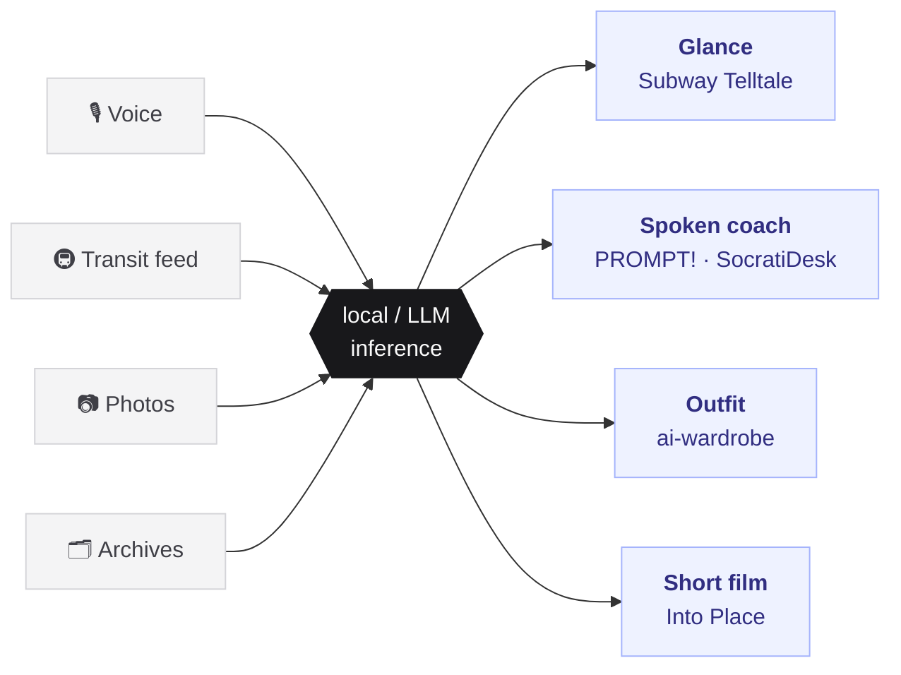

<h1 align="center">Dingran Dai</h1>

  <strong>Creative Technologist</strong> · Architecture → Interactive Systems · Cornell Tech ’27

  
  
  

<em>I draw it, I wire it, I ship it — usually in that week.</em>

 

## The through-line

Every project I build is the same circuit: take something the world already emits, run it through a model, hand it back as something a person can act on without reading a manual.

 

## The work

Scale runs from what fits in a palm to what holds a city.

| | Project | What it does | ✏️ | ⌨️ | 🔧 |
|:--|:--|:--|:-:|:-:|:-:|
| **1:1** | [Portable Subway Telltale](https://github.com/Daidai1031/Portable-Subway-Telltale) | Keychain display — glance and you know whether to run | ● | ● | ● |
| **1:5** | [PROMPT!](https://github.com/Daidai1031/PROMPT-) | Kids say what they notice out loud; coach answers, fully offline | ● | ● | ● |
| **1:5** | [SocratiDesk](https://github.com/Daidai1031/SocratiDesk) | A study companion that asks instead of answers | ● | ● | ○ |
| **1:100** | [ai-wardrobe](https://github.com/Daidai1031/ai-wardrobe) | Shoot your closet once, it dresses you for the weather | ● | ● | ○ |
| **1:5000** | [Into Place](https://github.com/Daidai1031/into-place) | Drop a pin — a place's real archive becomes a film you direct | ● | ● | ○ |
| **—** | [teaguard-trust-api](https://github.com/Daidai1031/teaguard-trust-api) | Flags which anonymous reviews need a human, not a verdict | ○ | ● | ○ |

✏️ designed · ⌨️ engineered · 🔧 fabricated — ● lead ○ n/a

 

## Bench

**Design** Figma · Rhino · Fusion 360 · Illustrator
**Build** Python · TypeScript · SQL · Bash
**Fabricate** ESP32 · Raspberry Pi · Jetson · Arduino · Laser · 3D print

 

## Now

Interactive devices + ubiquitous computing at Cornell Tech. Open to **summer internships** and **RA roles** in interactive systems and prototyping.
Previously — product strategy @ Xiaomi · urban data research @ SCUT · planning @ GZPI

Guangzhou → New York
