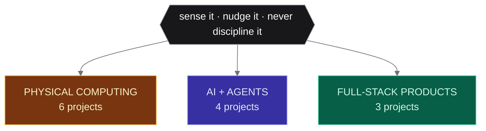

<h1 align="center">Dingran Dai</h1>

  <strong>Creative Technologist & AI Builder</strong> — Designer who builds, engineer who sketches 
  Architecture → Applied Information Science @ Cornell Tech

  
  
  

## Premise：Perception over prescription

Many corner park has a KEEP OFF THE GRASS sign, and a dirt line worn straight across the lawn behind it. The sign says what people should do; the dirt says what they were already doing. Five years of planning taught me which one to trust — you read how people actually move, then pave it.

I build products the same way. Each project below reads something already in motion — a heart rate, a slouch, a platform, a place's archive — and offers something back at the edge of attention. None of them run a compliance loop. Nothing here is trying to correct you.

<b>🟠 Physical Computing & Devices</b> — 6 projects

ESP32 · CircuitPython · Jetson · sensors · 3D printing

- **[Portable Subway Telltale](https://github.com/Daidai1031/Portable-Subway-Telltale)** — Keychain ambient display for Roosevelt Island. One glance tells you whether to run.
- **[PROMPT!](https://github.com/Daidai1031/PROMPT-)** — AI literacy card game for kids 10+. They say what they notice out loud; a coach replies. Fully offline on a Jetson, so no child's voice leaves the table.
- **[GeoMelody](https://github.com/Daidai1031/portfolio-next/tree/main/app/projects/geomelody)** — A wearable reads heart rate, ambient noise and motion, then surfaces five tracks from music you already love that fit where you are. The first version asked how you felt — but if you stop to answer, you've already left the moment.
- **[Sprout](https://github.com/Daidai1031/Sprout)** — Chest-clip wearable that turns posture into physics-driven bubbles. It shows you the slouch instead of buzzing at you to sit up.
- **[ER-Companion](https://github.com/Daidai1031/ER-Companion)** — Low-cost wristband that catches falls and seizures for ER patients who can't speak for themselves.
- **[Cat Companion](https://github.com/Daidai1031/ubicomp-cat-companion)** — A 3D-printed cat you level up by keeping your own daily quests.

<b>🔵 AI & Agent Systems</b> — 4 projects

RAG · ReAct agents · on-device inference · multi-signal classification

- **[SocratiDesk](https://github.com/Daidai1031/SocratiDesk)** — Voice-first study companion that asks instead of answers. No tabs, no copy-paste, just thinking aloud.
- **[TeaGuard Trust API](https://github.com/Daidai1031/teaguard-trust-api)** — Screens anonymous reviews for privacy and defamation risk. Refuses to rule on truth; flags what needs a human.
- **[Socratic Agent](https://github.com/Daidai1031/socratic-agent-local)** — Local ReAct agent scaffold behind the Socratic experiments.
- **[FitFindr](https://github.com/Daidai1031/ai201-project2-fitfindr-starter)** — Three-tool agent with a planning loop: finds secondhand listings, styles them against your wardrobe, writes the caption.

<b>🟢 Full-Stack Products</b> — 3 projects

Next.js · Supabase · fal.ai · Flask

- **[Into Place](https://github.com/Daidai1031/into-place)** — Drop a pin and a place's real archive becomes a short film you direct. Sourced material keeps its era and license; every generated frame stays labeled as generated.
- **[ai-wardrobe](https://github.com/Daidai1031/ai-wardrobe)** — Shoot your closet once, then let it dress you for the weather.
- **[portfolio-next](https://github.com/Daidai1031/portfolio-next)** — This site, hand-built. Next.js 16, Tailwind v4, MDX.

## Bench

       
 
    
 
      
 
    
 
     
 
      
 
      
 
    

